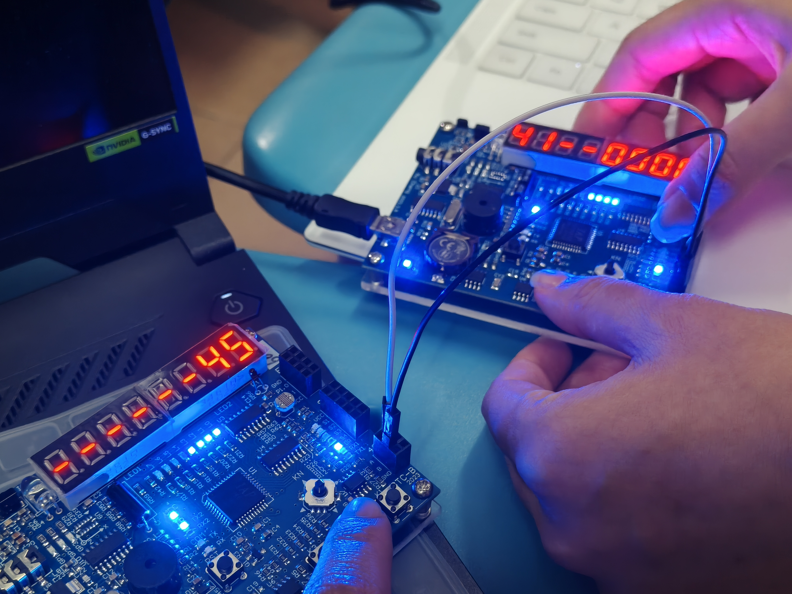
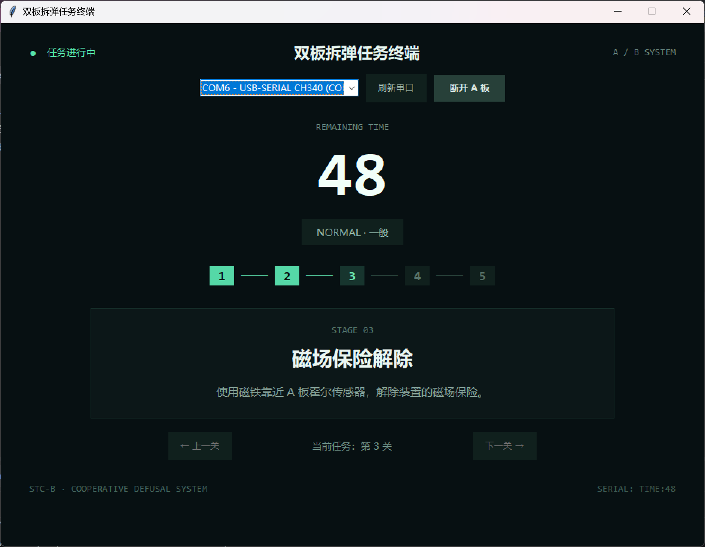
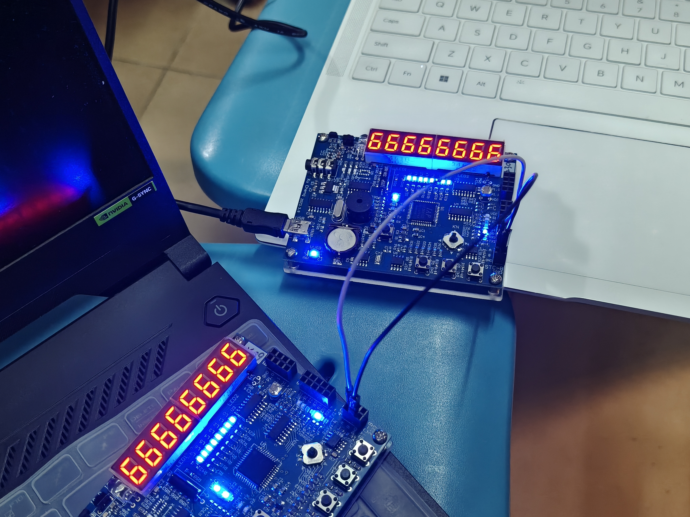
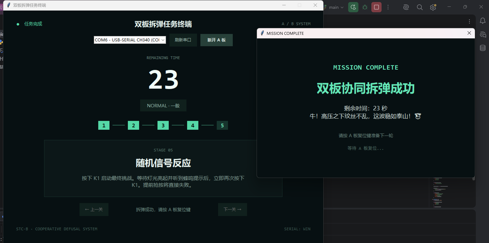
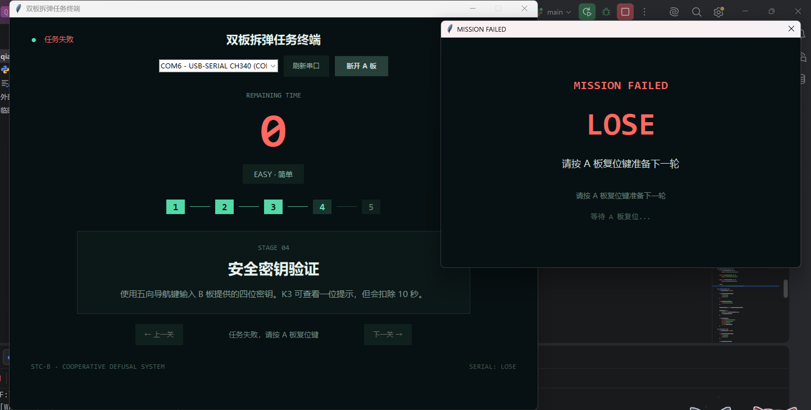

<div align="center">

# 💣 Dual-Board Defusal Terminal

### 基于 STC15F2K60S2 的双板协同拆弹挑战系统

**Dual MCU · Sensor Interaction · UART Communication · State Machine · Python GUI**

<br>


<br>

**光敏检测 · 双板通信 · 霍尔感应 · 密钥验证 · 随机反应 · 实时上位机**

</div>

---

## 🚀 项目简介

**Dual-Board Defusal Terminal** 是一套基于两块 STC-B 学习板开发的双板协同拆弹挑战系统。

系统以 **STC15F2K60S2** 为核心控制器，将光敏传感器、霍尔传感器、五向导航键、普通按键、LED、八位数码管和蜂鸣器等硬件资源整合到连续任务流程中，并通过 **UART 双板通信、事件驱动程序和状态机** 完成任务控制。

整个系统由三个终端协同运行：

- 🎯 **A Board / Main Terminal**：负责主要任务流程、传感器检测、密钥验证、反应挑战和全局状态控制
- 📡 **B Board / Intelligence Terminal**：负责随机密钥生成、情报传输、时间查看以及声光反馈
- 🖥️ **PC Mission Terminal**：负责五项任务展示、实时进度、剩余时间、难度和任务结果显示

三端共同构成：

```text
                    ┌──────────────────────┐
                    │     PC Terminal      │
                    │   Python / Tkinter   │
                    └──────────▲───────────┘
                               │
                         UART1 / USB
                               │
                               ▼
                    ┌──────────────────────┐
                    │       A BOARD        │
                    │    Main Terminal     │
                    └──────────┬───────────┘
                               │
                         UART2 / Link
                               │
                               ▼
                    ┌──────────────────────┐
                    │       B BOARD        │
                    │ Intelligence Terminal│
                    └──────────────────────┘
```

---

# 🎮 Mission Flow · 拆弹任务流程

系统设置五项连续任务，并通过全局倒计时将所有任务组织在同一场拆弹挑战中。

```text
                  SYSTEM READY
                       │
                       ▼
          ┌─────────────────────────┐
          │  01 · 光敏线路解除       │
          │  Light Sensor Defusal   │
          └────────────┬────────────┘
                       ▼
          ┌─────────────────────────┐
          │  02 · 双板情报通信       │
          │  Intelligence Link      │
          └────────────┬────────────┘
                       ▼
          ┌─────────────────────────┐
          │  03 · 霍尔磁场保险       │
          │  Magnetic Unlock        │
          └────────────┬────────────┘
                       ▼
          ┌─────────────────────────┐
          │  04 · 四位密钥验证       │
          │  Password Verification  │
          └────────────┬────────────┘
                       ▼
          ┌─────────────────────────┐
          │  05 · 随机信号反应       │
          │  Reaction Challenge     │
          └────────────┬────────────┘
                       ▼
                💥 DEFUSED 💥
```

任务运行过程中，A、B 两块开发板持续进行数据交互，PC 端同步更新当前任务和剩余时间。

### 🎬 实际拆弹过程

<div align="center">



*双板协同拆弹任务运行过程*

</div>

---

# 🧩 Five Challenges

## 01 / 光敏线路解除

A 板通过 ADC 周期性采集光敏传感器数据。

```text
ADC Sampling
      ↓
Threshold Detection
      ↓
Continuous Detection
      ↓
LED Progress
      ↓
LIGHT DEFUSED
```

系统设置光敏检测阈值，并要求玩家持续遮挡传感器约 **5 秒**。

遮挡过程中：

```text
█░░░░░░░
██░░░░░░
███░░░░░
████░░░░
█████░░░
██████░░
███████░
████████
```

8 个 LED 随持续时间逐级点亮，用于显示当前线路解除进度。

当光敏值重新超过阈值时，持续检测重新计数，从而提高光照检测的稳定性。

---

## 02 / 双板情报通信

光敏线路解除完成后，A 板通过 UART2 向 B 板发送任务请求。

```text
A BOARD
   │
   │ Request
   ▼
B BOARD
   │
   ├── Generate Random Code
   ├── Display Password
   │
   └── Send 4 Digits
            │
            ▼
         A BOARD
```

玩家按下 B 板 K1 后，B 板根据运行计数生成一组四位随机密钥：

```text
┌───────────────────┐
│      6 2 8 4      │
└───────────────────┘
```

密钥通过数码管显示，并通过 UART2 发送至 A 板保存。

随着任务继续推进，B 板隐藏密钥，玩家需要利用已经获得的信息完成后续验证。

---

## 03 / 霍尔磁场保险解除

A 板通过霍尔传感器检测外部磁场变化。

```text
WAITING FOR MAGNETIC FIELD
             │
             ▼
      Magnet Approaching
             │
             ▼
         Hall Event
             │
             ▼
      SAFETY UNLOCKED
```

检测到有效磁场靠近事件后，系统解除磁场保险并推进任务状态。

---

## 04 / 四位密钥验证

玩家需要输入此前从 B 板获得的四位随机密钥。

五向导航键承担密码输入功能：

| 操作 | 功能 |
| :---: | --- |
| ↑ | 当前数字 +1 |
| ↓ | 当前数字 -1 |
| ← | 输入位置左移 |
| → | 输入位置右移 |
| Center | 提交四位密钥 |
| K3 | 查看一位密钥提示 |

密码错误：

```text
WRONG PASSWORD
      │
      ▼
    -5 SEC
```

使用 K3 提示：

```text
K3 HINT
   │
   ▼
Reveal One Digit
   │
   ▼
 -10 SEC
```

提示位置按照使用次数循环变化。

密码验证成功后，系统进入最终反应挑战。

---

## 05 / 随机信号反应

进入最终任务后，LED 首先显示运行灯效果。

按下 K1 正式启动挑战：

```text
PRESS K1
   │
   ▼
Random Waiting
 2.5 ~ 6.0 s
   │
   ▼
LED SIGNAL
   │
   ▼
  +300 ms
   │
   ▼
BUZZER SIGNAL
   │
   ▼
REACTION TIMER
```

玩家需要在蜂鸣器有效信号出现后快速按下 K1。

提前抢按：

```text
FALSE START
     ↓
MISSION FAILED
```

超过反应时间限制：

```text
TIMEOUT
   ↓
MISSION FAILED
```

系统支持三档难度：

| Mode | Reaction Limit |
| :---: | ---: |
| 🟢 EASY | 3000 ms |
| 🟡 NORMAL | 2500 ms |
| 🔴 HARD | 1500 ms |

---

# 🧠 Software Architecture

嵌入式程序采用 **事件驱动 + 有限状态机** 组织整个任务流程。

```text
                    ┌────────┐
                    │  IDLE  │
                    └───┬────┘
                        ▼
                   ┌─────────┐
                   │  LIGHT  │
                   └────┬────┘
                        ▼
                   ┌─────────┐
                   │  LINK   │
                   └────┬────┘
                        ▼
                   ┌─────────┐
                   │  HALL   │
                   └────┬────┘
                        ▼
                  ┌──────────┐
                  │ PASSWORD │
                  └────┬─────┘
                       ▼
                  ┌──────────┐
                  │ REACTION │
                  └────┬─────┘
                       │
                ┌──────┴──────┐
                ▼             ▼
           ┌─────────┐   ┌─────────┐
           │ SUCCESS │   │ FAILED  │
           └─────────┘   └─────────┘
```

不同周期的系统回调用于处理传感器、通信、显示和全局计时：

```text
10 ms     → Communication / Buzzer Processing

100 ms    → ADC / LED / State Processing

1 s       → Global Countdown / Time Synchronization
```

系统能够持续处理传感器输入、按键事件、倒计时、双板通信和显示更新。

---

# 📡 Dual-Board Communication

A 板和 B 板通过 `UART2` 建立双向通信。

### A Board → B Board

```text
'C'      密钥任务请求
'H'      隐藏随机密钥
'S'      任务成功
0x80|T   剩余时间同步
```

### B Board → A Board

```text
[d0][d1][d2][d3]
```

四个字节分别对应四位随机密钥。

```text
B BOARD                     A BOARD

┌─────────┐                ┌─────────┐
│ 6 2 8 4 │ ─── UART2 ──► │ Code[4] │
└─────────┘                └─────────┘
                                │
                                ▼
                      Password Verification
```

这使第二项任务产生的数据能够直接参与后续密钥验证。

---

# 🖥️ PC Mission Terminal

PC 端采用：

```text
Python 3.11
     │
     ├── Tkinter
     │      └── Mission GUI
     │
     └── PySerial
            └── Serial Communication
```

主要展示：

- 🎯 五项任务说明
- 🧭 当前任务进度
- ⏱️ 全局剩余时间
- 🎚️ EASY / NORMAL / HARD
- 🔌 串口连接状态
- 🏆 Mission Complete
- 💀 Mission Failed
- 🔄 RESET 状态恢复

### Mission Terminal

<div align="center">



*Python 上位机任务终端*

</div>

任务开始前可以浏览五项任务说明。

A 板启动任务后，PC 端根据串口数据自动切换当前任务。

---

# 🛰️ PC Communication

A 板通过 `UART1 / USB` 向电脑端发送运行状态：

```text
RESET
START:1:60:1
STAGE:2
TIME:53
DIFF:2
WIN
LO5E
```

对应关系：

| Message | Function |
|---|---|
| `RESET` | 恢复初始状态 |
| `START:d:t:s` | 开始任务 |
| `STAGE:n` | 更新当前任务 |
| `TIME:xx` | 更新剩余时间 |
| `DIFF:n` | 更新任务难度 |
| `WIN` | 任务成功 |
| `LO5E` | 任务失败 |

PC 端采用独立串口读取线程：

```text
STC15
  │
  │ UART1 / USB
  ▼
Serial Reader
  │
  ▼
Message Queue
  │
  ▼
Protocol Parser
  │
  ▼
Tkinter Main Thread
  │
  ▼
Mission UI
```

串口消息进入队列后由 Tkinter 主线程统一处理，实现硬件状态与界面的实时同步。

---

# 💥 Mission Result

## 🏆 Mission Complete

五项任务全部完成后：

```text
A BOARD
   │
   ├────────────► B BOARD
   │                 │
   │                 ├── LED Animation
   │                 ├── 7-Segment Animation
   │                 └── Victory Music
   │
   └────────────► PC TERMINAL
                     │
                     ▼
              MISSION COMPLETE
```

<div align="center">



*双板成功反馈*

<br><br>



*上位机 Mission Complete 界面*

</div>

PC 端根据最终剩余时间生成对应评价：

```text
Remaining Time >= 40 s
→ 干得漂亮！任务处理得又快又稳。

Remaining Time >= 25 s
→ 表现很不错！整个拆弹节奏控制得很好。

Remaining Time >= 10 s
→ 成功完成任务！关键时刻依然稳住了。

Remaining Time < 10 s
→ 极限拆弹成功！最后关头完成解除，太刺激了。
```

---

## 💀 Mission Failed

抢按、反应超时或全局倒计时结束后，系统进入失败状态。

```text
╔══════════════════════════╗
║      MISSION FAILED      ║
║                          ║
║           LO5E           ║
╚══════════════════════════╝
```

<div align="center">



*上位机 Mission Failed 界面*

</div>

A 板重新复位后，PC 端接收：

```text
RESET
```

随后恢复：

```text
Timer .............. 60 s
Difficulty ......... EASY
Mission ............ Stage 1
Preview ............ ENABLED
Status ............. READY
```

系统即可进入下一轮任务。

---

# 🔧 Hardware Resources

| Hardware | Function |
|---|---|
| STC15F2K60S2 | 主控制器 |
| Photoresistor | 光敏线路检测 |
| Hall Sensor | 磁场保险检测 |
| 5-Way Navigation Key | 四位密钥输入 |
| K1 / K2 / K3 | 启动、难度、提示及任务交互 |
| 8 LEDs | 进度及任务状态反馈 |
| 8-digit 7-Segment Display | 密钥、时间及状态显示 |
| Passive Buzzer | 声音反馈 |
| UART1 | A板 ↔ PC |
| UART2 | A板 ↔ B板 |

---

# 🛠️ Tech Stack

```text
Embedded
├── C
├── STC15F2K60S2
├── Keil C51
├── ADC
├── GPIO / Key Event
├── Timer / Callback
├── UART1
└── UART2

PC Terminal
├── Python 3.11
├── Tkinter
├── PySerial
├── Threading
└── Queue
```

---

# 👥 Team & Contributions

项目由两名成员共同完成嵌入式程序、上位机功能以及系统联调，并按照任务模块进行分工。

## 👨‍💻 Member A：WanNanzhuo-Guoguo

### Embedded Development

**A板 · 光敏线路解除**

- 光敏 ADC 数据采集
- 光照阈值判断
- 连续遮挡约 5 s 判定
- LED 解除进度反馈
- 任务状态切换

**A板 · 密钥验证**

- 五向导航键四位密码输入
- 数字循环调整
- 输入位置控制
- 四位密钥校验
- 错误密码 `-5 s`
- K3 密钥提示
- 提示操作 `-10 s`
- 时间变化同步

**B板 · Control System**

- 四位随机密钥生成
- 密钥数码管显示
- 随机密钥发送
- 密钥显示 / 隐藏
- 剩余时间接收
- K2 时间查看
- 成功 LED 动画
- 数码管成功动画
- 蜂鸣器成功音乐
- B板任务状态控制

### PC Terminal

- 五项任务信息展示
- 任务开始前关卡预览
- 当前任务进度切换
- `START` 消息解析
- `STAGE` 消息解析
- Mission Complete 界面
- 剩余时间评价
- 成功状态复位
- 界面状态恢复

---

## 👨‍💻 Member B：ro111Doc

### Embedded Development

**A板 · 双板情报通信**

- A板任务请求
- B板四位密钥接收
- 密钥保存
- 密钥隐藏指令
- 通信阶段状态切换

**A板 · 霍尔磁场保险**

- 霍尔传感器初始化
- 磁场靠近事件检测
- 保险解除判断
- 任务状态推进
- 声光反馈

**A板 · 随机信号反应**

- K1 启动挑战
- 2.5～6 s 随机等待
- LED 信号提示
- 蜂鸣器有效信号
- 反应时间测量
- False Start 判断
- Timeout 判断
- EASY / NORMAL / HARD 难度控制

### PC Terminal

- 串口设备扫描
- 串口连接与断开
- 后台串口数据读取
- `TIME` 消息解析
- `DIFF` 消息解析
- 剩余时间显示
- 难度状态显示
- 设备连接状态
- `LO5E` 失败界面
- RESET 基础状态处理

---

# 🤝 System Integration

两名成员共同完成系统最终联调：

```text
Sensor Input
     │
     ▼
┌─────────┐
│ A BOARD │
└────┬────┘
     │ UART2
     ▼
┌─────────┐
│ B BOARD │
└─────────┘

     +

┌─────────┐
│ A BOARD │
└────┬────┘
     │ UART1
     ▼
┌─────────────┐
│ PC TERMINAL │
└─────────────┘
```

联调内容包括：

- A/B 板 UART2 通信
- 五项任务状态衔接
- 随机密钥跨任务传递
- 全局倒计时同步
- 时间惩罚同步
- 成功 / 失败状态处理
- A板与 PC 串口通信
- 硬件与 GUI 状态同步
- RESET 后系统恢复
- 完整拆弹流程测试

最终形成：

```text
Sensors
   ↓
MCU Processing
   ↓
State Machine
   ↓
Dual-Board Communication
   ↓
Hardware Feedback
   ↓
PC Visualization
```

---

# 🤖 AI Collaboration

开发过程中使用 **ChatGPT** 辅助程序设计、代码排查及部分功能实现。

**AI 参与代码比例约 45%。**

主要人工修改和调试内容包括：

1. 根据 STC-B 学习板实际接口完善光敏检测、导航键、霍尔检测和随机反应等功能，并通过实机测试确定光敏阈值、持续时间、时间惩罚和不同难度的反应参数。

2. 对 A、B 板通信过程进行调试，完善随机密钥、剩余时间和任务状态的数据传输，并处理按键响应、串口收发、数码管显示、LED 与蜂鸣器反馈等实际运行问题。

3. 完善五项任务之间的状态衔接及 Python 上位机功能，对任务预览、进度切换、串口信息解析、成功与失败结果、复位恢复等功能进行调试，并完成 A 板、B 板和 PC 三端整体联调。

---

# 📂 Repository Structure

```text
stc15f2k60s2-dualboard-defusal-terminal/
│
├── A板程序/
│   └── ...
│
├── B板程序/
│   └── ...
│
├── 上位机/
│   ├── main.py
│   └── requirements.txt
│
├── 示意图/
│   ├── 前端页面.png
│   ├── 拆弹失败-前端.png
│   ├── 拆弹成功-前端.png
│   ├── 拆弹过程示意-板子.jpg
│   └── 炸弹成功拆除-板子.jpg
│
└── README.md
```

---

# ✨ Project Highlights

```text
✔ Dual-MCU Collaboration
✔ Five-Stage Interactive Mission
✔ Multi-Sensor Interaction
✔ Event-Driven Embedded Programming
✔ Finite State Machine
✔ UART1 + UART2 Communication
✔ Random Cross-Stage Password
✔ Global Countdown
✔ Difficulty System
✔ Time Penalty System
✔ Hardware Sound & Light Feedback
✔ Python Serial GUI
✔ Hardware / PC Real-Time Synchronization
✔ Complete Mission Loop
```

系统形成了一条完整的数据与控制链路：

```text
Physical Interaction
        ↓
Sensor / Key Input
        ↓
STC15 Processing
        ↓
Mission State Machine
        ↓
A/B Board Communication
        ↓
LED / Display / Buzzer
        ↓
UART1
        ↓
Python Mission Terminal
```

---

# 🎯 System Status

<div align="center">

```text
╔══════════════════════════════════════╗
║                                      ║
║       DUAL-BOARD DEFUSAL SYSTEM      ║
║                                      ║
║  A BOARD ................. READY     ║
║  B BOARD ................. READY     ║
║  UART2 LINK .............. ONLINE    ║
║  PC TERMINAL ............. ONLINE    ║
║                                      ║
║  DIFFICULTY .............. EASY      ║
║  MISSION TIME ............ 60 SEC    ║
║                                      ║
║          > PRESS K1_                 ║
║                                      ║
╚══════════════════════════════════════╝
```

### 💣 READY TO DEFUSE

**STC15F2K60S2 · Embedded C · Dual MCU · UART · Python**

</div>
